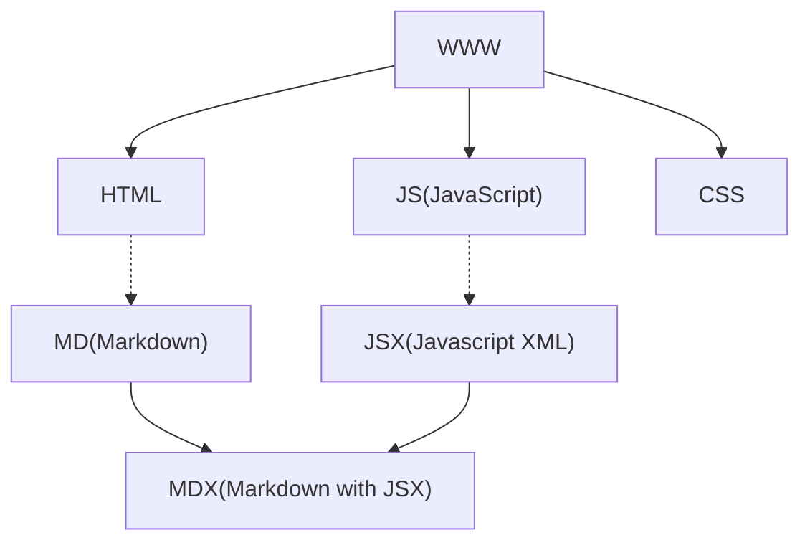

# MDX



[MDX(Markdown with JSX)](https://mdxjs.com/)는 [마크다운(Markdown)](./markdown)과 [JSX(JavaScript XML)](https://ko.legacy.reactjs.org/docs/introducing-jsx.html)를 결합한 언어로, 주로 React 기반의 웹 개발 환경에서 사용됩니다. MDX는 마크다운 문법에 React 컴포넌트를 포함시킬 수 있어, 동적이고 인터랙티브한 웹 페이지를 쉽게 작성할 수 있도록 지원합니다. 아래는 MDX와 일반적인 마크다운의 주요 차이점입니다:

### 1. **React 컴포넌트 삽입:**

- **Markdown:** 주로 정적인 텍스트 서식을 다룹니다. HTML 태그를 사용하여 간단한 구조를 만들 수 있지만, 동적인 React 컴포넌트를 삽입하기는 어렵습니다.
- **MDX:** 마크다운 문서 내에서 직접적으로 React 컴포넌트를 사용할 수 있습니다. JSX 문법을 활용하여 동적인 UI를 구성할 수 있습니다.

### 2. **JavaScript 통합:**

- **Markdown:** 주로 텍스트 서식을 다루며, JavaScript와의 통합이 제한적입니다.
- **MDX:** JavaScript 코드를 포함할 수 있어, 동적 데이터를 처리하거나 외부 데이터를 가져와 렌더링하는 데 용이합니다.

### 3. **확장성:**

- **Markdown:** 주로 정적인 문서 작성에 사용되며, 동적인 기능이나 데이터 통합에는 적합하지 않습니다.
- **MDX:** React의 생태계를 활용하여 동적이고 확장성 있는 웹 페이지를 작성하는 데 적합합니다.

### 4. **사용 예시:**

- **Markdown:**

  ```markdown
  # Markdown 문서

  이 문서는 정적인 텍스트를 포함하고 있습니다.
  ```

- **MDX:**

  ```jsx
  # MDX 문서

  이 문서는 동적인 React 컴포넌트를 사용할 수 있습니다.

  <MyComponent />
  ```

### 5. **용도:**

- **Markdown:** 주로 간단한 문서 작성, 블로그 게시물, README 등에서 사용됩니다.
- **MDX:** 주로 React 기반의 웹 애플리케이션에서 동적이고 인터랙티브한 컨텐츠를 작성할 때 사용됩니다.

MDX는 Brent Jackson에 의해 만들어진 것으로 알려져 있습니다. 그러나 정확한 MDX 최초 버전의 출시 날짜는 현재 제한된 정보로 인해 명확하게 확인할 수 없습니다. MDX는 React와 함께 사용되는 동적이고 확장 가능한 문서 작성의 필요성에 대응하여 만들어졌으며, 그 이후로 계속 발전하고 커뮤니티에서 지원되고 있습니다.
