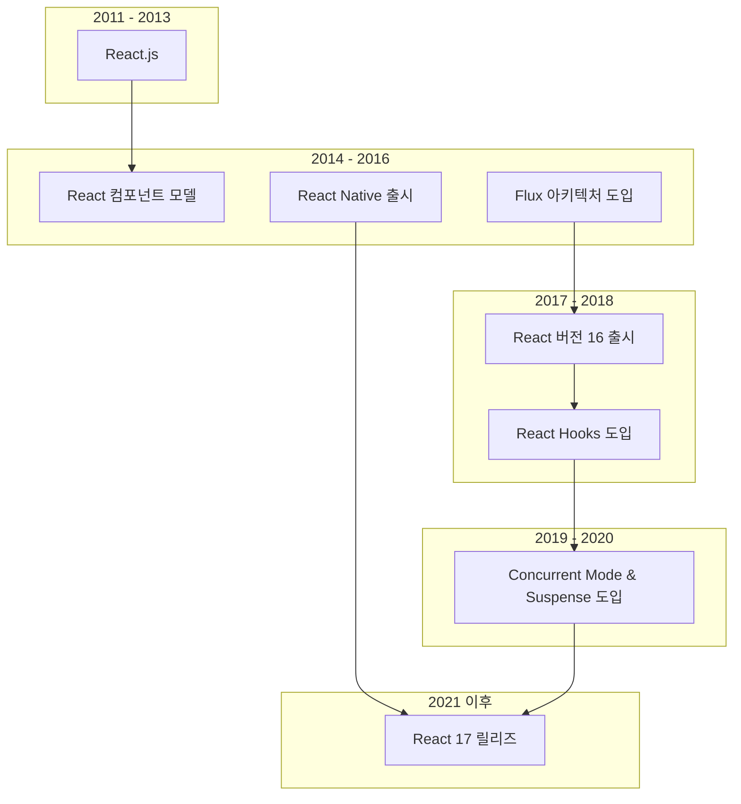

# React

React는 페이스북에서 개발한 오픈 소스 자바스크립트 라이브러리로, 사용자 인터페이스를 만들기 위한 목적으로 설계되었습니다. React는 웹 애플리케이션의 UI를 구성하는 데 중점을 둔 선언적이고 효율적인 방법을 제공하며, 컴포넌트 기반 아키텍처를 채택합니다.

## React Brief History



## React의 핵심 개념과 특징

React의 핵심 개념과 특징은 다음과 같습니다:

1. **컴포넌트 기반 구조**: React 애플리케이션은 작은 독립적인 컴포넌트로 구성됩니다. 각 컴포넌트는 자체적으로 상태(state)와 속성(props)을 가질 수 있으며, 재사용성과 유지보수성을 높이는 데 도움이 됩니다.

2. **가상 DOM (Virtual DOM)**: React는 가상 DOM을 사용하여 성능을 향상시킵니다. 실제 DOM과 동기화되는 대신에 가상 DOM을 사용하여 변경 사항을 비교하고 최소한의 업데이트만 수행합니다. 이로써 효율적인 렌더링이 가능해집니다.

3. **JSX (JavaScript XML)**: JSX는 JavaScript의 확장 문법으로, XML 또는 HTML과 유사한 문법을 사용하여 컴포넌트의 구조를 표현합니다. JSX는 가독성이 높고 컴파일 시에 일반 JavaScript 코드로 변환되어 실행됩니다.

4. **단방향 데이터 흐름**: React는 단방향 데이터 흐름을 강조합니다. 부모 컴포넌트에서 자식 컴포넌트로 데이터를 전달하며, 자식 컴포넌트는 상위 컴포넌트의 상태나 props를 변경하지 않습니다. 이로써 데이터의 흐름이 예측 가능하고 디버깅이 쉬워집니다.

5. **상태 관리**: React에서는 컴포넌트의 상태를 효과적으로 관리할 수 있습니다. 상태는 컴포넌트가 내부적으로 유지하며, 상태가 변경될 때마다 React는 자동으로 렌더링을 업데이트합니다.

6. **컴포넌트 라이프사이클**: React 컴포넌트는 생성, 업데이트, 소멸 등의 단계를 거치는 라이프사이클을 가지고 있습니다. 이를 통해 컴포넌트가 언제 어떤 동작을 수행해야 하는지를 제어할 수 있습니다.

React는 주로 단일 페이지 애플리케이션(SPA) 및 대규모 애플리케이션 개발에 사용되며, 다양한 생태계와 라이브러리(예: Redux)와의 통합이 가능합니다. React Native를 사용하면 React를 기반으로 하는 모바일 애플리케이션도 개발할 수 있습니다.

## React 경쟁 기술 비교

React는 웹 개발에서 주로 사용되는 라이브러리 중 하나이지만, 다른 기술과 라이브러리도 존재하며 각각의 장단점이 있습니다. 여기서는 React와 경쟁하는 몇 가지 기술을 비교해 보겠습니다.

1. **Angular:**
   - *언어*: React는 JavaScript를 사용하는 라이브러리이고, Angular는 TypeScript 기반의 프레임워크입니다.
   - *구조*: React는 라이브러리로서 뷰 레이어에 중점을 둡니다. Angular는 프레임워크로서 전체 애플리케이션의 구조와 관리를 다룹니다.
   - *양방향 데이터 바인딩*: Angular는 양방향 데이터 바인딩을 지원하여 모델과 뷰 간의 자동 동기화를 제공합니다. React는 단방향 데이터 흐름을 강조합니다.

2. **Vue.js:**
   - *크기*: Vue.js는 경량이면서도 간단한 구문을 제공하여 쉽게 배울 수 있습니다. React보다 작은 규모의 프로젝트나 초보자에게 인기가 있습니다.
   - *유연성*: Vue.js는 점진적으로 적용할 수 있어 기존 프로젝트에 점진적으로 도입하기 용이합니다. React는 전체 애플리케이션에서 사용되는 것이 일반적입니다.

3. **Svelte:**
   - *컴파일 타임*: Svelte는 컴파일 타임에 코드를 변환하여 런타임에 프레임워크 코드가 필요하지 않습니다. 이로써 더 작은 번들 크기와 빠른 실행 속도를 제공합니다.
   - *선언적 컴포넌트*: React와 달리 Svelte는 컴포넌트에 대한 선언적인 코드를 작성하지 않아도 됩니다. 변환 단계에서 자동으로 컴포넌트 코드를 생성합니다.

4. **Ember:**
   - *컨벤션 오버 구성*: Ember는 강력한 컨벤션을 가지고 있어 프로젝트 구조를 자동으로 생성하고 관리합니다. 이는 개발자들이 일관된 구조를 유지할 수 있도록 도와줍니다.
   - *인클루딩 기능*: Ember는 라우팅, 템플릿 엔진, 데이터 관리 등을 내장하고 있어 추가적인 라이브러리나 프레임워크를 도입하지 않아도 풀스택 애플리케이션을 구축하는 데 용이합니다.

이러한 기술들은 각자의 특성에 따라 선택되며, 프로젝트의 규모, 개발자의 경험, 선호하는 언어 등에 따라 적합한 기술이 달라질 수 있습니다.

## React 앱 만들기

React로 간단한 웹 애플리케이션을 만들어보는 것은 재미있고 유용한 경험일 수 있습니다. 아래는 React로 시작하는 간단한 To-Do 리스트 애플리케이션을 만드는 예제입니다. 이 예제는 React의 기본적인 개념을 소개하고 컴포넌트 간의 상태 관리를 다룹니다.

1. **프로젝트 설정:**
   React 애플리케이션을 만들기 위해 Create React App을 사용할 수 있습니다. 터미널에서 다음 명령어를 실행하여 Create React App을 설치하고 새로운 프로젝트를 생성합니다.

   ```bash
   npx create-react-app react-todo-app
   cd react-todo-app
   ```

2. **컴포넌트 작성:**
   `src` 폴더 안에 `TodoApp.js`와 `TodoList.js`라는 두 개의 컴포넌트를 생성합니다.

   **TodoApp.js:**
   ```jsx
   import React, { useState } from 'react';
   import TodoList from './TodoList';

   function TodoApp() {
     const [todos, setTodos] = useState([]);
     const [newTodo, setNewTodo] = useState('');

     const addTodo = () => {
       if (newTodo.trim() !== '') {
         setTodos([...todos, { id: Date.now(), text: newTodo }]);
         setNewTodo('');
       }
     };

     const removeTodo = (id) => {
       setTodos(todos.filter((todo) => todo.id !== id));
     };

     return (
       <div>
         <h1>React Todo App</h1>
         <input
           type="text"
           value={newTodo}
           onChange={(e) => setNewTodo(e.target.value)}
         />
         <button onClick={addTodo}>Add Todo</button>
         <TodoList todos={todos} removeTodo={removeTodo} />
       </div>
     );
   }

   export default TodoApp;
   ```

   **TodoList.js:**
   ```jsx
   import React from 'react';

   function TodoList({ todos, removeTodo }) {
     return (
       <ul>
         {todos.map((todo) => (
           <li key={todo.id}>
             {todo.text}
             <button onClick={() => removeTodo(todo.id)}>Remove</button>
           </li>
         ))}
       </ul>
     );
   }

   export default TodoList;
   ```

3. **애플리케이션 실행:**
   터미널에서 다음 명령어를 실행하여 React 애플리케이션을 시작합니다.

   ```bash
   npm start
   ```

4. **브라우저에서 확인:**
   기본적으로 [http://localhost:3000](http://localhost:3000)에서 애플리케이션을 확인할 수 있습니다. Todo를 추가하고 삭제하는 기능이 포함된 간단한 React Todo 애플리케이션이 생성되었습니다.

이것은 React의 간단한 예제일 뿐이며, React 개발에 대한 추가적인 학습이 필요합니다. React의 문서와 튜토리얼을 참고하여 더 많은 기능과 개념을 익히면서 프로젝트를 확장해보세요.